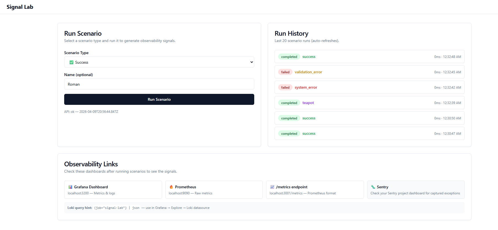
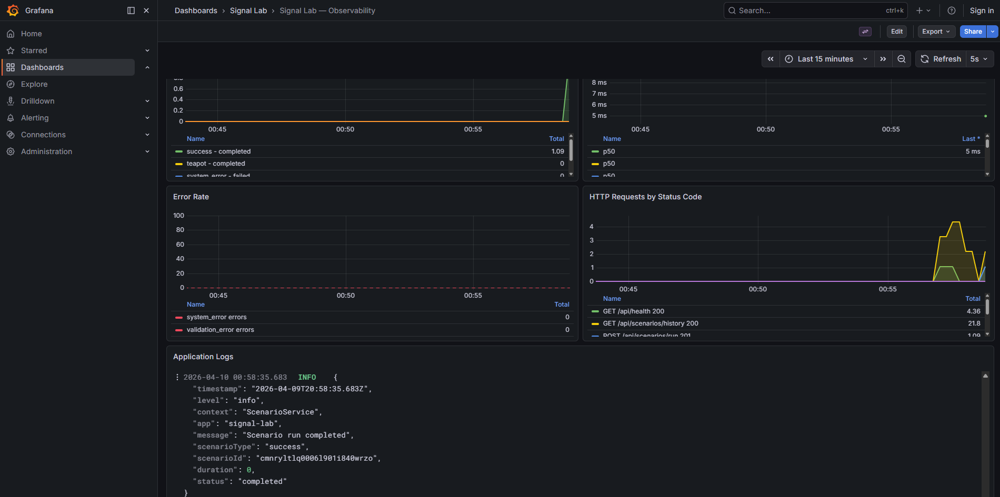
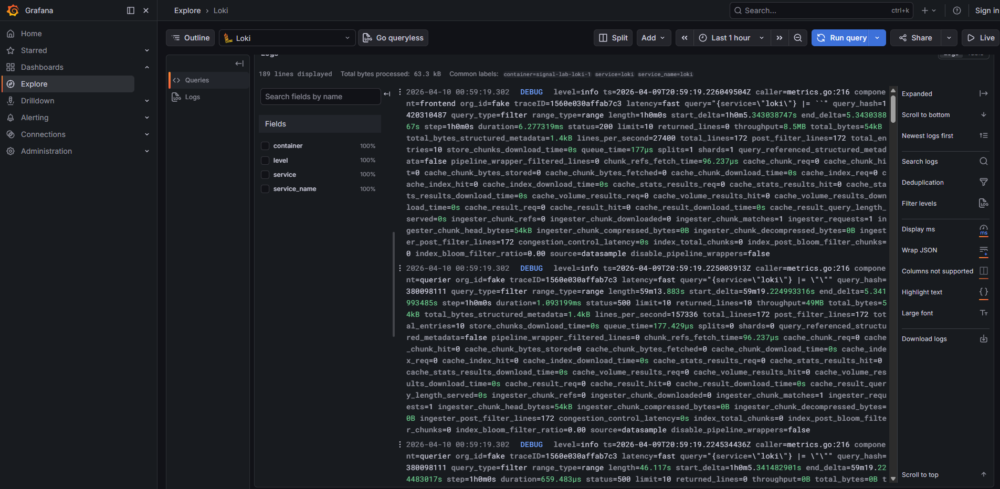
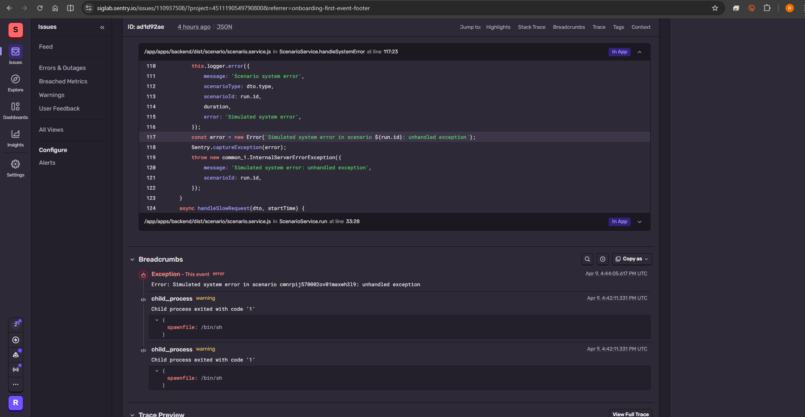

# Signal Lab — Submission Checklist

---

## Репозиторий

- **URL**: `git@github.com:Dedalus-Stephen/SignalLab-Assessment.git`
- **Ветка**: `main`
- **Время работы** (приблизительно): `6` часов

---

## Запуск

```bash
# Команда запуска:
docker compose up -d

# Команда проверки:
curl http://localhost:3001/api/health

# Команда остановки:
docker compose down
```

**Предусловия**: Docker 29.2+, Node v22.14+ (только для локального запуска, не нужен в докере), порты 3000, 3001, 3100, 3200, 5432, 9090 должны быть доступны.

---

## Стек — подтверждение использования

| Технология | Используется? | Где посмотреть |
|-----------|:------------:|----------------|
| Next.js (App Router) | ☑ | `apps/frontend/src/app/page.tsx`, `apps/frontend/src/app/layout.tsx` |
| shadcn/ui | ☑ | `apps/frontend/src/components/ui/` — Button, Card, Input, Badge |
| Tailwind CSS | ☑ | `apps/frontend/src/app/globals.css`, className usage throughout `page.tsx` |
| TanStack Query | ☑ | `apps/frontend/src/app/page.tsx` — `useQuery` for health + history, `useMutation` for run |
| React Hook Form | ☑ | `apps/frontend/src/app/page.tsx` — `useForm`, `register`, `handleSubmit` |
| NestJS | ☑ | `apps/backend/src/` — modules, controllers, services, decorators |
| PostgreSQL | ☑ | `docker-compose.yml` — `postgres:16-alpine`, port 5432 |
| Prisma | ☑ | `prisma/schema.prisma` — ScenarioRun model, migration in `prisma/migrations/` |
| Sentry | ☑ | `apps/backend/src/main.ts` — `Sentry.init()`, DSN via env |
| Prometheus | ☑ | `apps/backend/src/metrics/` — prom-client, `GET /metrics` endpoint |
| Grafana | ☑ | `docker-compose.yml` — port 3200, provisioned dashboards in `monitoring/grafana/` |
| Loki | ☑ | `docker-compose.yml` — port 3100, config in `monitoring/loki/` |

---

## Observability Verification

| Сигнал | Как воспроизвести | Где посмотреть результат |
|--------|-------------------|------------------------|
| Prometheus metric | Run any scenario from UI at `localhost:3000` | `http://localhost:3001/metrics` — look for `scenario_runs_total`, `scenario_run_duration_seconds` |
| Grafana dashboard | Run 2-3 scenarios of different types | `http://localhost:3200` → "Signal Lab — Observability" dashboard. 3 panels: Runs by Type, Latency Distribution, Error Rate |
| Loki log | Run any scenario | Grafana (`localhost:3200`) → Explore → select Loki datasource → query `{job="signal-lab"} | json` |
| Sentry exception | Run "system_error" scenario from UI | Open Sentry project dashboard (DSN configured in `.env`) → see captured `InternalServerErrorException` |

---

## Cursor AI Layer

### Custom Skills

| # | Skill name | Назначение |
|---|-----------|-----------|
| 1 | `observability` | Step-by-step guide to add Prometheus metrics (counter + histogram), structured logging (NestJS Logger, JSON format), and Sentry integration (captureException for 5xx, breadcrumbs for 4xx) to any new endpoint |
| 2 | `nestjs-endpoint` | Complete scaffold recipe for a new NestJS endpoint: module → controller → service → DTO (class-validator + Swagger) → Prisma model → observability wiring |
| 3 | `shadcn-form` | Wires React Hook Form + zod schema + TanStack Query useMutation + shadcn/ui components into a validated form with loading states, error display, and toast feedback |
| 4 | `signal-lab-orchestrator` | Small-model PRD orchestrator: analyzes PRD, scans codebase, plans, decomposes into atomic tasks, delegates via Task tool, reviews quality, generates report. Tracks state in context.json for resume |

### Commands

| # | Command | Что делает |
|---|---------|-----------|
| 1 | `/add-endpoint` | Scaffolds a complete NestJS endpoint with controller, service, DTO, Swagger docs, Prisma model, and full observability |
| 2 | `/check-obs` | Audits all backend services for observability completeness: metrics, structured logging, Sentry integration. Produces pass/fail report |
| 3 | `/health-check` | Verifies entire Docker stack: all 7 services running, backend health OK, Swagger available, Prometheus scraping, Loki ready, Grafana up, end-to-end signal test |
| 4 | `/run-prd` | Executes a PRD through the orchestrator pipeline (7 phases). Supports `--resume` for interrupted runs |

### Hooks

| # | Hook | Какую проблему решает |
|---|------|----------------------|
| 1 | After Prisma schema edit (`afterFileEdit` on `schema.prisma`) | Reminds agent to run `prisma migrate dev` and `prisma generate` — prevents TypeScript types and DB from getting out of sync |
| 2 | After controller edit (`afterFileEdit` on `*.controller.ts`) | Checks that Swagger decorators, Prometheus metrics, and structured logging exist on modified endpoints |
| 3 | Secret guard (`beforeShellExecution`) | Blocks shell commands containing hardcoded passwords, tokens, or API keys — prevents accidental credential exposure |

### Rules

| # | Rule file | Что фиксирует |
|---|----------|---------------|
| 1 | `stack-constraints.mdc` | Allowed and forbidden libraries (e.g., no Redux, no SWR, no TypeORM). Always applied |
| 2 | `observability-conventions.mdc` | Metric naming (snake_case, _total for counters), structured log format (JSON with scenarioType, scenarioId, duration), Sentry usage rules |
| 3 | `prisma-patterns.mdc` | No raw SQL, PrismaService injection pattern, migration workflow, error code handling |
| 4 | `frontend-patterns.mdc` | TanStack Query for server state, React Hook Form for forms, shadcn/ui for components, Tailwind for layout |
| 5 | `error-handling.mdc` | Maps error types to HTTP codes, log levels, and Sentry actions. Prevents silent error swallowing |

### Marketplace Skills

| # | Skill | Зачем подключён |
|---|-------|----------------|
| 1 | `vercel-react-best-practices` | Next.js App Router conventions, server vs client components, caching, metadata API |
| 2 | `shadcn` | Full shadcn/ui component library reference — dialogs, data tables, theming, dark mode |
| 3 | `tailwind-design-system` | Tailwind utility classes, responsive patterns, CSS variable integration with shadcn themes |
| 4 | `nestjs-best-practices` | DI patterns, guards, interceptors, pipes, module organization |
| 5 | `prisma-cli` | Prisma CLI commands, schema syntax, migration workflows |
| 6 | `prisma-postgres` | Prisma + PostgreSQL patterns — connection pooling, indexes, JSON columns, performance |
| 7 | `prisma-postgres-setup` | Initial Prisma + PostgreSQL setup — configuration, Docker, connection strings |
| 8 | `postgresql-table-design` | Table design best practices — normalization, indexing strategies, constraints |
| 9 | `docker` | Docker Compose config, multi-stage builds, health checks, volume management, networking |

**Что закрыли custom skills, чего нет в marketplace:**

Очевидно, что покрыть потребности какого-либо конкретного продукта, пользуюсь только скиллами из маркетплейсов невозможно. Observabilitity: прометей, нест и сентри настраиваются специфичным для проекта образом.
nestjs-endpoint: создает эндпоинт специфичный для проекта со всеми интеграциями метрик.
shadcn-form: неочевидная настройка UI.
signal-lab-orchestrator: полностью кастомный оркестратор для проекта.

---

## Orchestrator

- **Путь к skill**: `.cursor/skills/signal-lab-orchestrator/` (SKILL.md, COORDINATION.md, EXAMPLE.md)
- **Путь к context file** (пример): `.execution/2026-04-09-23-29/context.json`
- **Сколько фаз**: 7 (analysis → codebase scan → planning → decomposition → implementation → review → report)
- **Какие задачи для fast model**: Adding Prisma fields/models, creating DTOs, simple endpoints, adding metrics/logs, basic UI components, config files, documentation updates. Rule: if a task can be described in 1-2 sentences and has a single clear output file, it's fast.
- **Поддерживает resume**: да — reads context.json on startup, skips completed phases and tasks, resumes from first pending/in_progress item.

---

## Скриншоты / видео

- [ ] UI приложения:

- [ ] Grafana dashboard с данными

- [ ] Loki logs

- [ ] Sentry error


---

## Что не успел и что сделал бы первым при +4 часах

1. Тесты, проверяющие работоспособность всего приложения: каждый сценарий и соответсвующий лог или метрика.
4. Улучшил бы оркестратор. Особо не углублялся, но первый запуск и внесенные изменения не были идеальными.
5. Автоматизация деплойа. Через Gitlab CI/CD, как вариант, с запуском тестов.

---

## Вопросы для защиты (подготовься)

1. **Почему именно такая декомпозиция skills?**
    Observability требовался в ТЗ. Скилл по созданию эндпоинтов отвечает за самую рутинную работу в nest.js проектах: код эндпоинта, дто-шки, бойлерплейт модулей и т.д. shadcn-form по той же причине. Вообще, по мере роста проекта, растет и потребность в других, более специфичных и сложноустроенных скиллов.

2. **Какие задачи подходят для малой модели и почему?**
   Простенькие задачи по типу создания DTO, boilerplate scaffolding кода, линтинг, написание простого readme, файлов конфигурации, скажем, простого Dockerfile-а и т.д. Зачастую, интуитивно бывает ясно, в какой ситуации к модели какой мощности обратиться. Очевидно, что в работе с крупными, запутанными фрагментами кода, либо задачами по проектированию/реструктурированию больших проектов слабая модель не справится.

3. **Какие marketplace skills подключил, а какие заменил custom — и почему?**
   Подключил все перечисленные маркетплейс скиллы из PRD. За исключением prisma-orm: не нашел именно этот скилл, но нашел схожие. Стоило ли мне заменить не найденные скиллы кастомными?

4. **Какие hooks реально снижают ошибки в повседневной работе?**
   Например, если в команде разработчик воркфлоу обязывает пушить изменения в отдельную ветку, хук, запрещающий пушить непосредственно в мейн, может оказаться очень полезен. Либо хук проверяющий не оставил ли разработчик что-либо конфиденциальное в своем коммите.

5. **Как orchestrator экономит контекст по сравнению с одним большим промптом?**
   По принципу разделения ответственности между агентами: мы не перегружаем основной чат, используем саб-агенты для малых задач, которые не требуют всего контектста. Например: в знании основного контекстного окна мы поддерживаем всю информацию необходимую для правильного построения проекта, при поступлении, скажем, задачи по созданию UI form, мы делегируем ее выполнению саб-агенту, которому весь контекст не нужен. В итоге основной контекст не перегружен для него неважной информациий о создании формы, а саб-агент, создающий форму, не перегружен всем знанием о проекте.